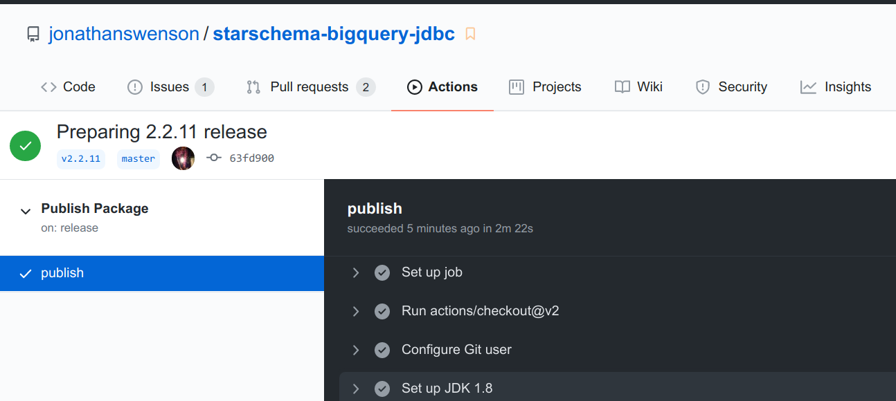

# bqjdbc


[](https://javadoc.io/doc/com.github.looker-open-source/bqjdbc)

`bqjdbc` (also known as `starschema-bigquery-jdbc`) is a
[JDBC Driver](https://docs.oracle.com/javase/8/docs/technotes/guides/jdbc/) for
[Google BigQuery](https://cloud.google.com/bigquery).

You can create a JDBC connection easily for a variety of authentication types.
For instance for a _service account_ in a properties file:

```ini
projectid=disco-parsec-659
type=service
user=abc123e@developer.gserviceaccount.com
password=bigquery_credentials.p12
```

```java
import net.starschema.clouddb.jdbc.*;
import java.sql.*;

public static class Example {
    public static void main(String[] args) {
        // load the class so that it registers itself
        Class.forName("net.starschema.clouddb.jdbc.BQDriver");
        final String jdbcUrl =
            BQSupportFuncts.constructUrlFromPropertiesFile(
                BQSupportFuncts.readFromPropFile(
                    getClass().getResource("/serviceaccount.properties").getFile()));
        final Connection con = DriverManager.getConnection(jdbcUrl);
        // perform SQL against BigQuery now!
    }
}
```

The dependency is provided on
[Maven central](https://search.maven.org/search?q=a:bqjdbc)
at the following coordinates:
```xml
<dependency>
    <groupId>com.google.looker-open-source</groupId>
    <artifactId>bqjdbc</artifactId>
    <version>...</version>
</dependency>
```

A fat (shaded) jar is also available:
```xml
<dependency>
    <groupId>com.google.looker-open-source</groupId>
    <artifactId>bqjdbc</artifactId>
    <version>...</version>
    <classifier>shaded</classifier>
</dependency>
```

## Development

### Download and build

We require Java (JDK 8 through 15) and Apache Maven (3.2.5 or higher).

```bash
$ git clone git://github.com/looker-open-source/bqjdbc.git
$ cd bqjdbc
$ mvn clean install -DskipTests
```

### Releases

Releases are handled through GitHub actions, and kicked off when a release is created.

> 💡 Make sure that  `-SNAPSHOT` is not part of the version when you create a release.

1. Prepare a release by removing `-SNAPSHOT` from the version in _pom.xml_

2. Initiate a release and be sure to write a meaningful description.

    > This will also create a tag with the specified name

    

3. Check the GitHub action to see that it was a success

    

4. Create a new commit by bumping the version and adding `-SNAPSHOT` to it

## History

`bqjdbc` was forked from https://code.google.com/p/starschema-bigquery-jdbc/ in 2013
and has since been maintained by a few folks at [Looker](https://github.com/looker-open-source).
